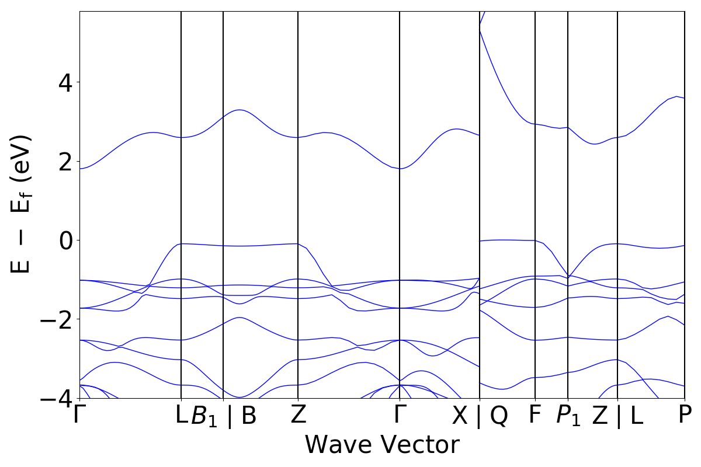

# 绘制能带图 
参考[案例](http://matgenb.materialsvirtuallab.org/2017/09/03/Analyze-and-plot-band-structures.html)
获取一个band structure，如bs,再使用
```python
plotter = BSPlotter(bs)
plotter.get_plot().show()
```
绘制图形，样例为


bs类型为
```python
<class 'pymatgen.electronic_structure.bandstructure.BandStructureSymmLine'>
```
计划使用
```python
BandStructureSymmLine.from_dict(d)
```
函数获取一个BandStructureSymmLine类，其中d为字典类。

下一步使用excel中的数据构造d。

字典中包含<class 'numpy.int64'>类，保存出错，尝试转为int
```python
# 检测int64转化为str
class NpEncoder(json.JSONEncoder):
    def default(self, obj):
        if isinstance(obj, np.int64):
            return str(obj)
            
            
with open('structure.json', 'w') as f:
    json.dump(list1, f, cls=NpEncoder)
```

模仿structure.json仅构造矩阵尝试绘图


经过尝试，需要b.json中5个属性可绘制图形，分别为：
- "lattice_rec":
- "efermi":
- "kpoints":
- "bands":
- "labels_dict":横坐标上的标签


BandStructure对象参数：
- projections:投影：轨道投影的字典为{spin：ndarray}。该
ndarrayare的指数[band_index，kpoint_index，orbital_index，
ion_index]。如果带结构不是自旋极化，我们只在Spin.up下存储一个数据集。


